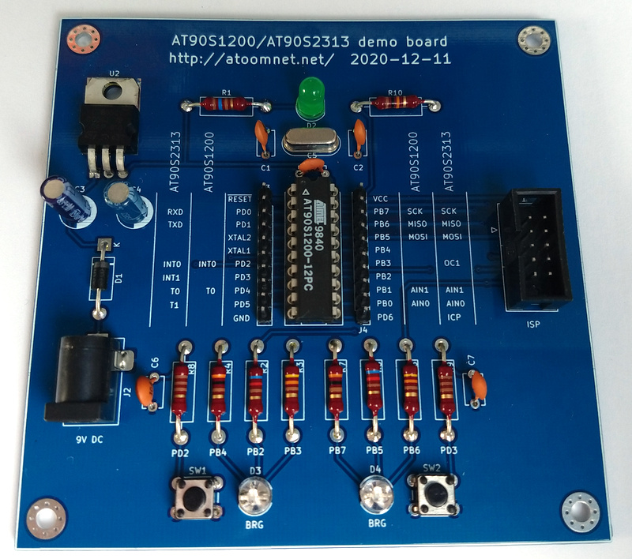
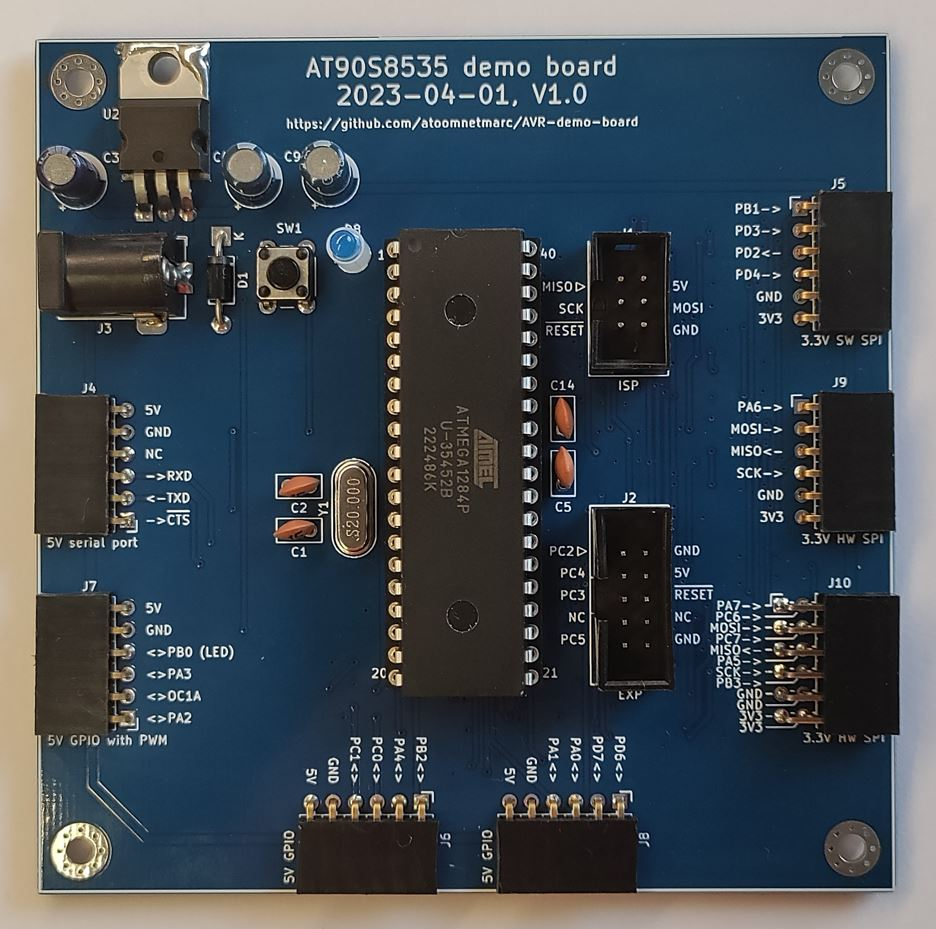

# AT90S1200

Demo board for the 20-pin AT90S1200 and AT90S2313 microcontroller.

Yes these chips are old, Arduino was not a thing back then. The AT90S1200 on the pcb is my first microcontroller I bought and programmed. It has a date code of 1998 week 40. I wrote software for it using AVR studio (4?) in assembler and programmed it using the [Handyman programmer and software made by Elektor](https://www.elektormagazine.com/magazine/elektor-199712/33974).

This AT90S1200 has only ever been used in breadboards, now about 20 years later it got its own PCB.

Like the silkscreen pinout? [Here](AVR%20overview.md) is a complete(-ish) overview of all know pin-compatible AT90S* microcontrollers and their pin functions.

# AT90S2323

The AT90S2323 is a 8-pin microcontroller with a whopping 3 I/O-pins. I believe this is the first 8-pin AVR.

One day I found some on eBay, bought them and proceeded to created this demo board to show its capabilities. I figured to control 128 LEDs with 3 I/O-pins. To expand de 3 I/O to drive 128 LEDs I used 3 shift registers in a 16x8 configuration. The shift registers however need 4 signals to drive them: DATA, CLK, RCLK and OE. When I tied RCLK and OE together I could bring that down to 3.

https://user-images.githubusercontent.com/48124268/116798381-1cadf400-aaef-11eb-9674-959b9dbc6236.mp4

# AT90S8535

The AT90S8535 belongs to the first 40-pin AVR microcontrollers from Atmel together with the AT90S8515. There also existed a 4K flash version of this chip, but that version seems to be only short lived, if at all.

This board breaks out all pins of the microcontroller into mostly PMOD compatible connectors. Mostly because if I understand correctly the voltage for PMOD IO and VCC should normally be at 3.3V. This board has both 5V and 3.3V PMOD connectors.

All pin-compatible microcontrollers will fit. When using a ATmega163 or newer, J8 is useable as a 5V I2C PMOD connector. When using a ATmega8535, J5 can be used as a 3.3V HW SPI PMOD port. When using ATmega323 or newer, EXP can be used as a JTAG connector.

On the back of the PCB there is a SOT-23 voltage monitor that functions as a BOD (brow out detector). Unlike newer parts, the AT90S8535 does not have a onboard BOD.

More information about this board: [README.md](at90s8535/README.md)

# Programming vintage AVRs in 2023

## Programmer

Make a [Arduino-as-ISP-shield](https://github.com/atoomnetmarc/Arduino-as-ISP-shield), then use AVRDUDE or [AVRDUDESS](https://blog.zakkemble.net/avrdudess-a-gui-for-avrdude/) to program the .hex file. This works under Windows 10.

AVRDUDE 6.3 is unable to program the AT90S2323 because it wrongly assumes this chip is the same as a AT90S2343, but it is not. Edit avrdude.conf and add the contents of [avrdude-at90s2323.conf](avrdude-at90s2323.conf) to just below the AT90S2343 config. This new section is a copy of the AT90S2343 section with one change, the chip signature.

## AVR Studio 4.19

Use the ancient [AVR Studio v4.19.730](https://www.microchip.com/mplab/avr-support/avr-and-sam-downloads-archive) to compile programs for the old AT90S* AVR's.

To compile c-programs you can still use [WinAVR-20100110-install.exe](https://sourceforge.net/projects/winavr/files/WinAVR/20100110/) containing ~~an old~~ a mature GCC compiler versioned 4.3, but you need some to [fix some incompatibilities with Windows 10](https://www.avrfreaks.net/forum/windows-81-compilation-error?page=all) in order to make it work.\
There is a simpler solution, just use an [updated GCC](https://blog.zakkemble.net/avr-gcc-builds/). This update contains GCC version 12 and works to compile programs for the old AT90S* chips in AVR Studio 4.19.

## Visual Studio Code + PlatformIO

I was pleasantly surprised to find out that compiling a c-program using VSCode and PlatformIO also is a viable option. See the firmware directory of the AT90S2323 for an example on how to configure PlatformIO or see [the PlatformIO example native-blink](https://github.com/platformio/platform-atmelavr/tree/develop/examples/native-blink).

It is also possible to program the AT90S1200 in VSCode with PlatformIO in assembler! Have a look at my PlatformIO [blink](at90s1200/Firmware/blink/) project. You could also program the ATtiny2313 with the same assembler (and some `#if defined` macros) and debug using Microchip Studio.

