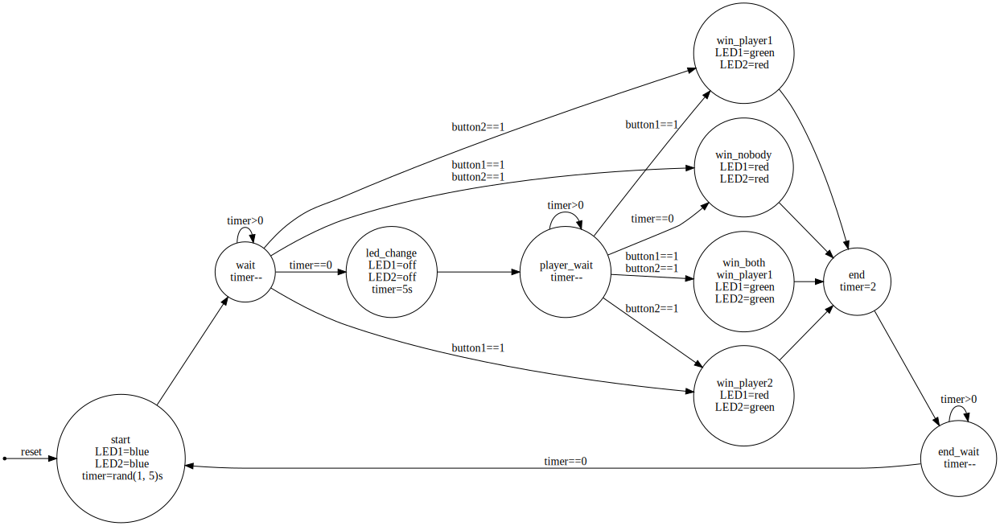

# Reaction Time Game

2 players battle for the fastest reaction time. Game automatically starts when MCU is powered on. Players must press button when blue LED turn off. This will happen after a random amount of time.

The fastest reaction time is indicated by a few seconds of green LED. Slowest reaction time is indicated by red LED. When somehow both players are equally fast, because buttons are samples 1000 times a second, then both get green LED. When no reaction was given, both get red LED. Pressed too early? Red.

Randomness is generated when a button is pressed.

State machine:\

This game was specifically written in gcc assembly for the RAM-less AT90S1200, but also made working on pin-compatible newer AVR parts.

| MCU           | tested?                   |
| --            | --                        |
| AT90S1200     | :ballot_box_with_check:   |
| AT90S2313     | :ballot_box_with_check:   |
| ATtiny2313    | :ballot_box_with_check:   |
| ATtiny2313A   | :black_square_button:     |
| ATtiny4313    | :black_square_button:     |

